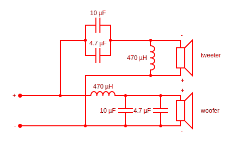

# 27" iMac 2012 (A1419, EMC 2546) reuse project

Someone was selling this iMac on craigslist for $80. He claimed that the logic board side of the display connector was busted when he tried to clean up the internal. So I jumped on it, hoping to convert it into an external display and docking station, which doesn't need the logic board. When I was going to pick it up, the seller told me the connector on the display was damanged too and I could have it for free. I couldn't argue with free. So here we are. I thought I'd give it a try, hoping that the damaged pins are NCs.

Here's the basic info of the computer:
* iMac 2012
* Model: A1419
* EMC: 2546
* [Spec](https://everymac.com/systems/apple/imac/specs/imac-core-i5-2.9-27-inch-aluminum-late-2012-specs.html)

## Disassembly
The screen is glued to the body with adhesive strips. The previous owner already opened it up for cleaning. So it I only needed to use a small suction cup to lift it open. If you have an unopened one, you could just heat up the edges, pry open with guitar picks, and lift the screen with suction cups. There's plenty of youtube videos on this topic. Note that this one is different from 2011 models where the screen is mounted with magnets. There's also [this post](https://www.ifixit.com/Teardown/iMac+Intel+27-Inch+EMC+2639+Teardown/17828) on iFix for a similar model. I had a very hard time cleaning up the glue residue though. It's annoyingly sticky. I soaked it with alcohol and scrapped with a credit card. It required a lof of patience.

After examining the connectors, I suspect that it was only the cable that was damanged. The connector actually looked OK under a magnifier. So I ordered a video controller to give it a try. After I got the controller and hooked it up, the screen lit up without problems. Yay! So, I decided to embark on the whole project. This post documents the journey.

Here's the list of features I want:

* P0: LCD panel
* P0: Speakers
* P1: PD charging the host
* P1: Camera
* P1: Microphone
* P2: RJ45 & USB 2.0 ports

I already know the LCD panel can be reused. The speakers should be relatively straight-forward. I'd love to reuse the power supply if possible. But it's not a big deal if I can't. It should be pretty easy to stick another PSU inside. I'm also hoping to reuse the IO panel on the back side for a few USB ports as well as the RJ45 for Ethernet. I am also planning to expose a USB C socket there for connecting to the host computer.

## Overall Design
At the center of everything is a USB C adapter that connects to the host. It would have an HDMI video output, an Ethernet port, and a few USB ports. I have previously used an Anker 343 USB C adapter for a similar project. But it does not have Ethernet, which could be mitigated by using a USB to Ethernet adapter. However, it is out of stock everywhere, including Anker's own website. It's possibly discontinued. So I got this [uni 8 in 1 adapter](https://www.amazon.com/dp/B0C3GDT9XN) from Amazon, with these features:

* 4K @ 60Hz
* 1 Gbps Ethernet
* 100W PD (90W output)
* 2 x USB 3.0
* 1 x USB 2.0
* SD reader (I have no use for it)

```
┌─────┐                ┌───────────┐
│ PSU │                │ LCD Panel │
└─────┘                └───────────┘
   ↓            backlight ↑     ↑ eDP
┌────────┐   12V    ┌──────────────────┐ audio ┌────────┐
│ Switch │─────────>│ Video controller │──────>│ X─over │
└────────┘          └──────────────────┘       └────────┘
   ↓ 12V                   ↑ HDMI                  ↓
┌─────────────┐ PD  ┌───────────────┐         ┌──────────┐
│ DC Extender │────>│ USB C adapter │         │ Speakers │
└─────────────┘     └───────────────┘         └──────────┘
                       ↑       ↑     ┌──────┐
┌──────┐               │       ├───> │ RJ45 │
│ Host │ <─────────────┘       │     └──────┘
└──────┘    PD,data            │     ┌─────────────┐
                               ├───> │ USB 2.0 hub │
                               │     └─────────────┘
                               │       ↕         ↕
                               │  ┌────────┐  ┌─────┐
                               │  │ Webcam │  │ Mic │
                               │  └────────┘  └─────┘
                               ↓
                        ┌─────────────┐
                        │ USB 2.0 hub │
                        └─────────────┘
                               ↑
         ┌─────────────┬───────┴─────┬─────────────┐
         ↓             ↓             ↓             ↓
    ┌──────────┐  ┌──────────┐  ┌──────────┐  ┌──────────┐
    │ USB Port │  │ USB Port │  │ USB Port │  │ USB Port │
    └──────────┘  └──────────┘  └──────────┘  └──────────┘
```

## Power
The PSU (Model: ADP-300AF T) provides a single 12V always-on rail `G3H`. Other voltages and rails are done on the logic board. So that was easy. I just need to cut the original wires and solder my own. It provides 300W at 12V. Here's an excerpt from the logic board shcematic.


The USB C adapter takes in a PD charger and pass-through charges the host. To provide PD, I am going to use a [DC Extender](https://slimq.life/products/dc-to-usb-extender-for-150w-240). It has a DC booster and can provide all the voltages specified in PD 3.0 and maxes out at 100W, which is exactly the maximum the USB C adapter can draw. The video controller runs on 12V DC directly. The switch that controls the power for everything is a [flip flop mechanical relay](https://www.amazon.com/Latching-Flip-Flop-Bistable-Self-Locking-Trigger/dp/B07VL9DBGT) that runs on the always-on power rail of the PSU.

## Display
The model of the LCD panel is LM270WQ1(SD)(F1). Here are the [specs on panelook](https://www.panelook.com/modeldetail.php?id=18520). You can find the datasheet in this folder. Here's the summary of its specs.

* Resolution: 2560(RGB)×1440, Quad-HD  108PPI
* Signal Type: eDP (4 Lanes) , 40 pins Connector
* Backlight: 3 strings WLED , 30K hours , No Driver

 I ordered a [controller](https://www.aliexpress.us/item/3256807252731476.html) from AliExpress. If the link doesn't work anymore, just search for the model number. It's powered by RTD2556, a rather popular eDP driver chip. The unit comes with a separate backlight driver board. All other WLED panels I've seen don't need it; the driver would be already on the video controller. I'm not sure about what it does exactly.


The backlight connector that came with it is a pain in the neck to push into the one on the LCD panel side. And the connection is rather wobbly. So I decided to cut off both connectors and solder or crimp the wires to a new connector and connect it directly to the backlight controller. 


## Speakers
Each speaker assembly has two drivers: a tweeter and a woofer. The codec on the logic board must have a DSP to separate the frequencies. So I need a crossover, since I'm dealing with analog audio output here. I used an [online calculator](https://goodcalculators.com/crossover-calculator/) and came up with the following circuit. I used a crossover frequency of 2000 Hz, which is a good estimate without knowing the exact specs of the drivers.



The video control board has built-in amps and they seem to be powerful enough to drive the speakers.

## Camera
Originally, I wanted to reuse the camera. But after opening up the machine and reading the schematic, I realized that camera doesn't have a USB interface. Instead, the controller chip is on the motherborad. The camera talks SMIA. I have no expertise in decoding the protocol, although it's an open standard.

So I decided to get a tiny USB camera module, hoping it'd fit in the tiny space. If that doesn't work, I could always use an external webcam. It's not as aesthetic. But I'm not that picky.

After some research, I came upon this camera sensor ov5693. I also found [boards](https://www.aliexpress.us/item/3256805396719075.html) on Aliexpress that drive the sensor and turn it into a USB device. Then I 3d printed a bracket to fit the sensor into the place evacuated by the original camera, which is quite a challenge, since the space is very packed.


## Microphone
Originally, I also wanted to reuse the microphone. It looks like a MEMS PDM microphone. However, the original connector seems to have a short and I can't figure it out without damaging it. It's a 0.4 mm pitch 6 pin connector. I have no idea where to find a replacement. So I figure it's easier to just replace it altogether. And I'm replacing the camera anyway. So I might as well remove everything in that space.

I have done something similar in [another project](https://github.com/delingren/hp_iq804) so I have a little knowledge about digital microphones. The original microphone is stereo and there's two meshes on the case. They are close to each other and are not even laid out horizontally. I don't see the point of having a stereo microphone for a DIY project like this. And the microphone is only going to be used for video meetings. So I am going to keep it simple and use a mono microphone.

The heart of this component is a Pi Pico clone and a MEMS PDM microphone. I'm not going to delve into the details here since it's been elaborated in the other project. But I've included the source code in this repo under `pdm_microphone` folder. Basically, it'll interface with the host as a USB microphone.

## IO Panel

The original IO panel has openings for 4 USB A, 2 mini DP, and 1 RJ45 ports. I have no use for the mini DP ports. But I need a USB C female connector. So I decide to cut the bridge between the two mini DP ports to make it big enough for the USB C connector. I am using a USB C extension cable, with the female side exposed to the outside. Yes, I know extension cables are not supposed to exist according to USB 3 spec. But eh.

I also really wanted to provide an Ethernet adapter, because, why not? I found this [RJ45 socket](
https://www.aliexpress.us/item/3256806005093192.html) on Aliexpress. I then crimped the wires into a male plug, basically making it into an extension cable.


## Final Assembly